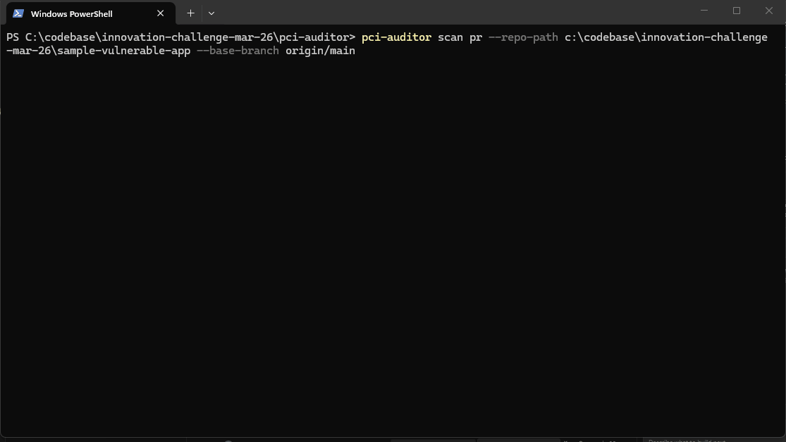
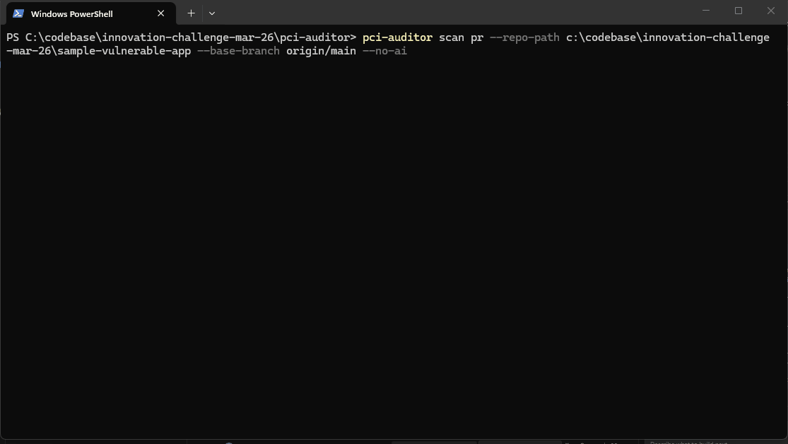
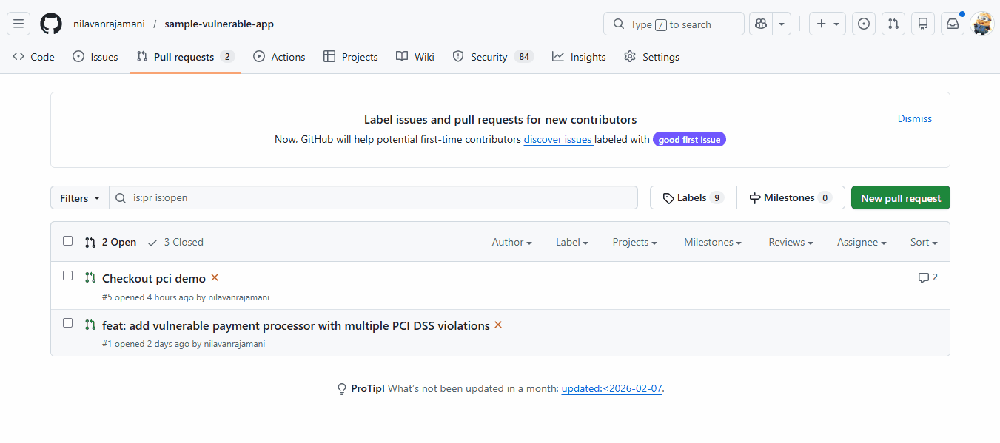
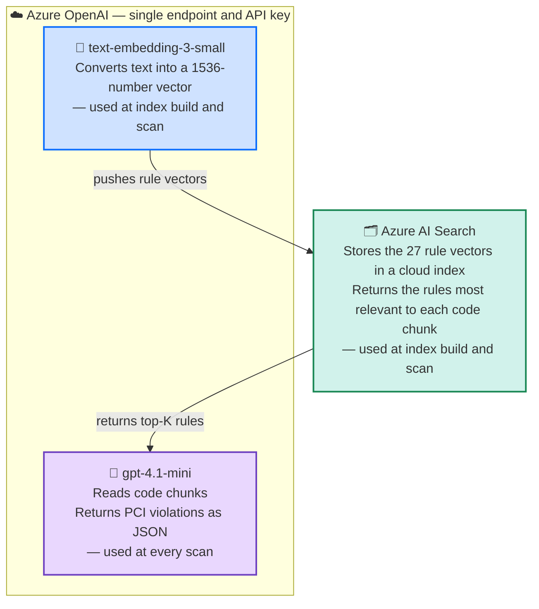
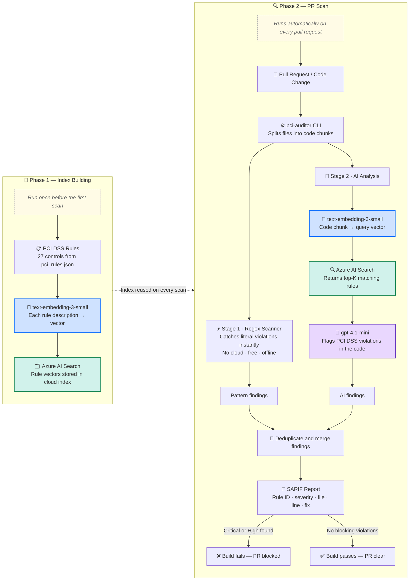

# PCI Auditor

A developer-first PCI DSS 4.0 compliance scanner that detects payment card security
violations in source code — powered by Azure OpenAI and integrated into CI/CD pipelines.

**PR scan with AI analysis** — catches violations the moment code changes:


**Fast pattern-only mode** — instant results, no cloud required:


**CI/CD build blocking** — automatically blocks merge on violations:


---

## VS Code Extension

The **[PCI DSS Auditor](https://github.com/nilavanrajamani/vscode-pci-auditor)** VS Code extension wraps this CLI to bring compliance scanning directly into the editor — live squiggly lines, a violations tree, CodeLens buttons, and one-click **Fix with Copilot** prompts.

→ [github.com/nilavanrajamani/vscode-pci-auditor](https://github.com/nilavanrajamani/vscode-pci-auditor)

---

## The Problem

PCI DSS 4.0 became mandatory on **March 31, 2024**. Organisations that handle payment
card data must comply with ~260 controls spanning cryptography, access control, logging,
network security, and secure coding practices. Violations carry fines up to $100,000/month
and can result in losing the ability to process card payments.

Yet most teams only discover compliance gaps during annual audits or after a breach.
PCI Auditor moves compliance checks **left** — into the pull request, before code ships.

---

## What It Does

PCI Auditor is a Python CLI tool with two scan modes:

| Mode | Command | Use case |
|---|---|---|
| **PR scan** | `pci-auditor scan pr` | Scans only lines changed in a pull request — fast, low noise |
| **Codebase scan** | `pci-auditor scan codebase` | Full recursive scan of an entire repository |

Each finding includes:
- The **specific PCI DSS 4.0 rule ID** being violated (e.g. Rule 3.3.1)
- Severity: `critical`, `high`, `medium`, `low`
- File path and line number
- Description of the violation
- Concrete remediation guidance
- Source: `pattern` (regex) or `ai` (Azure OpenAI)

The tool exits with code `1` when critical or high violations are found, **failing the
CI/CD build automatically**.

---

## Azure Resources

Three Azure services power the tool. Start here before walking through the flow.



---

## End-to-End Flow



---

## Detection Evolution

How each Azure service added improves what the tool can find. Each tier builds on the one before it.

```mermaid
flowchart TD
    CODE["📄 Source code chunk<br/>contains potential PCI violations"]

    subgraph T1 ["⚡  Tier 1 — No Azure · Pattern scan only"]
        direction TB
        REGEX["Regex matches code_indicators patterns<br/>against the chunk text — always runs, free, offline"]
        FOUND1["🔴 Literal violations detected<br/>hardcoded PAN · CVV stored after auth<br/>disabled SSL · plaintext password<br/>deprecated crypto (DES, RC4)"]
        REGEX --> FOUND1
    end

    subgraph T2 ["🧠  Tier 2 — + gpt-4.1-mini  (Azure OpenAI · GPT deployment)"]
        direction TB
        ALL27["All 27 PCI DSS rules injected into prompt"]
        GPT["gpt-4.1-mini reasons over code + rules"]
        FOUND2["🔴 Semantic violations added<br/>missing audit_log() before PAN access<br/>overly broad role grants card-data read<br/>SQL query built from raw user input<br/>unencrypted PAN traced to DB insert"]
        ALL27 --> GPT --> FOUND2
    end

    subgraph T3 ["🔢  Tier 3 — + text-embedding-3-small  (Azure OpenAI · Embedding deployment)"]
        direction TB
        EMBED["Code chunk → 1,536-float query vector<br/>Cosine similarity vs 27 stored rule vectors"]
        TOPK["Only top-8 most relevant rules sent to GPT<br/>not all 27"]
        FOUND3["✅ Same violations · sharper rule citations<br/>Correct rule ID cited more reliably<br/>Fewer irrelevant rules in prompt<br/>Lower token cost per scan"]
        EMBED --> TOPK --> FOUND3
    end

    subgraph T4 ["🗂️  Tier 4 — + Azure AI Search  (hybrid cloud index)"]
        direction TB
        HYBRID["BM25 keyword score<br/>+ vector cosine score<br/>+ category metadata filter"]
        TOPK2["Top-8 rules, best-disambiguated<br/>AES chunk → Rule 3.7.1 not 8.6.2<br/>NullHandler chunk → Rule 10.3.3 not 10.2.1"]
        FOUND4["✅ Best-precision rule attribution<br/>Closely related rule pairs correctly separated<br/>Shared cloud index for all CI/CD runners<br/>No embedding file to distribute across machines"]
        HYBRID --> TOPK2 --> FOUND4
    end

    CODE --> T1
    T1 -->|"add Azure OpenAI GPT deployment"| T2
    T2 -->|"add Azure OpenAI Embedding deployment"| T3
    T3 -->|"add Azure AI Search service"| T4

    style REGEX  fill:#fff3cd,stroke:#ffc107,stroke-width:2px
    style FOUND1 fill:#fff3cd,stroke:#ffc107,stroke-width:2px
    style ALL27  fill:#e9d7fe,stroke:#6f42c1,stroke-width:2px
    style GPT    fill:#e9d7fe,stroke:#6f42c1,stroke-width:2px
    style FOUND2 fill:#e9d7fe,stroke:#6f42c1,stroke-width:2px
    style EMBED  fill:#cfe2ff,stroke:#0d6efd,stroke-width:2px
    style TOPK   fill:#cfe2ff,stroke:#0d6efd,stroke-width:2px
    style FOUND3 fill:#cfe2ff,stroke:#0d6efd,stroke-width:2px
    style HYBRID fill:#d1f2eb,stroke:#198754,stroke-width:2px
    style TOPK2  fill:#d1f2eb,stroke:#198754,stroke-width:2px
    style FOUND4 fill:#d1f2eb,stroke:#198754,stroke-width:2px
```



---

## Demo

> Scanning a file with a hardcoded PAN, CVV, and plaintext password:

```
$ pci-auditor scan codebase --path ./examples

PCI DSS 4.0 Compliance Scan Results
====================================

>> examples/payment_processor.py

  [CRITICAL]  Rule 3.3.1  line 12   [pattern]
    SAD (sensitive authentication data) including full PANs must not be stored after authorization.
    pan = "4111111111111111"
    Fix: Tokenise the PAN using a PCI-compliant vault. Never store raw PANs.

  [CRITICAL]  Rule 3.3.2  line 13   [pattern]
    SAD such as CVV/CVC must not be stored after authorization.
    cvv = "123"
    Fix: Remove all CVV storage. CVV must not be retained post-authorisation.

  [HIGH]  Rule 8.6.1  line 14   [ai]
    Hardcoded credential detected. Storing passwords in source code violates PCI DSS 8.6.1.
    db_password = "hunter2"
    Fix: Use a secrets manager (Azure Key Vault, HashiCorp Vault) or environment variables.

+-----------------+-------+
| Severity        | Count |
|-----------------+-------|
| Critical        |     2 |
| High            |     1 |
| Files scanned   |     1 |
+-----------------+-------+

FAIL Build FAILED: Critical/High PCI DSS violations detected
```

**Exit code: 1** — the pipeline fails and the PR is blocked.

---

## LLM Usage

### Which model

Azure OpenAI via **Azure AI Foundry** — deployment name is fully configurable
(`AZURE_OPENAI_DEPLOYMENT` env var). Designed and tested with **gpt-4.1-mini**.

### Why LLMs?

Regex patterns catch the obvious: hardcoded PANs, CVVs, insecure protocols.
But PCI DSS violations are frequently **semantic**, not syntactic:

| Violation | Why regex fails | What the LLM catches |
|---|---|---|
| Rule 10.2.1 — missing audit log before accessing cardholder data | No fixed pattern | "This function reads PAN from the DB but never calls `audit_log()` first" |
| Rule 6.2.4 — SQL injection in payment query | Too many false positives | Understands query construction context |
| Rule 7.2.1 — overly permissive access control | Domain-specific logic | "This role check allows any authenticated user to read card data" |
| Rule 3.4.1 — PAN inserted into DB without encryption | Multi-line logic | Traces where the variable came from and whether it was encrypted |

### Prompting approach

The system prompt instructs the model to act as a **PCI DSS 4.0 compliance auditor**
and return **structured JSON only** — no prose, no markdown. Each response is a typed
array of findings with `rule_id`, `severity`, `line_number`, `description`, and
`recommendation`.

```
System: You are a PCI DSS 4.0 compliance security auditor specialising in code review.
        Return ONLY a valid JSON array. No markdown, no explanation text outside the JSON.
        If no violations are found, return: []

User:   File: payment/processor.py
        Lines: 1-200

        Applicable PCI DSS 4.0 rules to check:
        - Rule 3.3.1 (Critical): SAD including full PANs must not be stored...
          Hint: Identify any code that stores, logs, or persists full PANs...
        ...               ← top-8 relevant rules (RAG) instead of all 27

        [source code chunk]
```

### Semantic rule retrieval (RAG)

By default every AI prompt injects all 27 PCI DSS rules. With RAG enabled, each
code chunk is first **embedded** — converted to a vector — so that only the top-K
rules whose meaning is closest to the code are injected into the prompt. This narrows
the model's focus, cuts token cost, and sharpens rule citations.

Two retrieval backends store the rule vectors differently:

| Backend | Index location | Best for |
|---|---|---|
| **local** *(default)* | `~/.pci-auditor/rule_embeddings.json` — JSON on disk | Local dev, single machine |
| **azure-search** | Azure AI Search cloud index | CI/CD, multi-developer teams |

Build the index once after install (or after `rules update`):

```bash
# Local cosine-similarity backend (no extra infra)
pci-auditor rules index-build

# Azure AI Search backend
pci-auditor rules index-build --backend azure-search
```

Once built, scanning picks it up automatically when `AZURE_OPENAI_EMBEDDING_DEPLOYMENT`
is set. If the index has not been built the tool falls back silently to injecting all
27 rules.

---

#### What is a vector embedding?

The `text-embedding-3-small` model converts any piece of text into a list of **1,536
numbers** (a *vector*). Texts with similar meaning produce numerically similar vectors
— even when no words overlap. Relevance is measured with **cosine similarity**: the
angle between two vectors. A score near `1.0` means nearly identical meaning; near
`0.0` means unrelated.

```
 TEXT                                      VECTOR (1,536 floats)
 ────────────────────────────────────────  ──────────────────────────────────────────
 PCI Rule 3.3.1:
 "Sensitive authentication data (SAD)  →  [ 0.12, -0.87,  0.34,  0.55, -0.09, ... ]
  including full PANs must not be
  stored after authorisation."

 Code chunk:
 "pan = row['card_number']             →  [ 0.11, -0.83,  0.37,  0.51, -0.10, ... ]
  db.insert('payments', pan=pan)"
                                                              ↑
                                          similar numbers = similar meaning
                                          cosine similarity ≈ 0.94  ──  HIGH MATCH ✓
 ────────────────────────────────────────  ──────────────────────────────────────────
 PCI Rule 12.3.3:
 "All cryptographic cipher suites in   →  [ 0.45,  0.23, -0.61,  0.78,  0.32, ... ]
  use are documented and reviewed
  every 12 months."
                                          cosine similarity ≈ 0.10  ──  LOW  MATCH ✗  (excluded)
```

---

#### Step 1 — Index-build: rules → vectors  *(runs once)*

`pci-auditor rules index-build` sends each of the 27 rule descriptions to the embedding
model and persists the resulting vectors to whichever backend you choose. The full
pipeline is shown in [Phase 1 — Index Building](#end-to-end-flow) in the End-to-End Flow diagram.

Two backends are available:

| Backend | Index location | Best for |
|---|---|---|
| **local** *(default)* | `~/.pci-auditor/rule_embeddings.json` — JSON on disk | Local dev, single machine |
| **azure-search** | Azure AI Search cloud index | CI/CD, multi-developer teams |

---

#### Step 2 — Scan: code chunk → query vector → top-K rules → LLM

Every source file is split into ≤200-line chunks. In PR mode only changed diff hunks
are used — massively reducing the volume sent to the embedding model and LLM. The full
pipeline is shown in [Phase 2 — PR Scan](#end-to-end-flow) in the End-to-End Flow diagram.

#### Detection mode at a glance

See [Scan commands](#scan-commands) in Getting Started for the full mode comparison table.

### Cost control

- Files are chunked at 200 lines (configurable) to stay within token limits.
- In PR mode, only **changed lines** are sent — massively reducing token usage on large repos.
- RAG reduces prompt size further by sending only the top-K relevant rules per chunk (default 8, configurable via `PCI_AUDITOR_TOP_K_RULES`).
- `--detection-mode pattern` enables pattern-only scanning for fast offline / cost-free runs (legacy alias: `--no-ai`).
- The AI client gracefully degrades to pattern-only mode if credentials are absent.

---

## Architecture

```
┌─────────────────────────────────────────────────────────────────┐
│                        pci-auditor CLI                          │
│        (Click — scan pr / scan codebase / rules / rules         │
│                  index-build)                                   │
└──────────┬────────────────────────────┬────────────────────────-┘
           │                            │
    ┌──────▼──────┐              ┌──────▼──────┐
    │  PR Scanner │              │  Codebase   │
    │             │              │  Scanner    │
    │ git diff    │              │             │
    │ → changed   │              │ recursive   │
    │   lines     │              │ file walker │
    └──────┬──────┘              └──────┬──────┘
           │                            │
           └──────────┬─────────────────┘
                      │
               ┌──────▼──────┐
               │ File Scanner │
               │              │
               │  Stage 1:    │◄──── pci_rules.json (27 rules, PCI DSS 4.0.1)
               │  Regex       │      Bundled + updatable from URL
               │  patterns    │
               │              │
               │  Stage 2:    │◄──── RuleRetriever (RAG)
               │  AI analysis │      │  LocalRuleIndex  (cosine sim, JSON)
               │  (per chunk) │      │  AzureSearchIndex (vector search)
               │              │      └─ top-K rules / chunk
               │              │◄──── Azure OpenAI (gpt-4.1-mini)
               │              │      Structured JSON prompts
               └──────┬──────┘
                      │
               ┌──────▼──────┐
               │  Reporter   │
               │             │
               │  console    │  ← colour-coded terminal output
               │  JSON       │  ← machine-readable findings
               │  SARIF 2.1  │  ← Azure DevOps Security tab
               └─────────────┘
```

### Key design decisions

**Semantic rule retrieval (RAG)** — See [Semantic rule retrieval (RAG)](#semantic-rule-retrieval-rag) in the LLM Usage section for a full explanation of embeddings, cosine similarity, and the two retrieval backends.

**Two-stage scanning** — Regex runs first (fast, free, offline). AI runs second on the
same chunks, catching what regex missed. Findings are deduplicated by `(rule_id, file, line)`.

**Rules as data** — PCI DSS rules live in [pci_auditor/rules/pci_rules.json](pci_auditor/rules/pci_rules.json),
not in code. Each rule carries `code_indicators` (regex patterns) and an `ai_prompt_hint`
(natural language instruction injected into the model context). Rules are independently
updatable via `pci-auditor rules update`.

**SARIF output** — The tool emits SARIF 2.1.0, the industry-standard static analysis
format. Azure DevOps natively renders SARIF findings in the **Security** tab of pipeline
runs, with inline file/line annotations — no custom plugin required.

**Graceful degradation** — If Azure OpenAI credentials are missing, the tool falls back
to pattern-only mode automatically. The build still runs; it just uses regex only.

---

## Project Structure

```
pci-auditor/
├── pci_auditor/
│   ├── cli.py                  ← CLI entry point (Click)
│   ├── config.py               ← Config loader (env vars + .pci-auditor.yml)
│   ├── models.py               ← Finding and ScanResult dataclasses
│   ├── scanner/
│   │   ├── file_scanner.py     ← Pattern + AI scan orchestration per file
│   │   ├── pr_scanner.py       ← git diff parser → changed line numbers
│   │   └── codebase_scanner.py ← Recursive file walker with exclude patterns
│   ├── rules/
│   │   ├── pci_rules.json      ← Bundled PCI DSS 4.0.1 rules (27 controls)
│   │   ├── rule_loader.py      ← Load / filter rules
│   │   └── rule_manager.py     ← Download / validate / update rules from URL
│   ├── ai/
│   │   ├── openai_client.py    ← AzureOpenAI client, prompt builder, response parser
│   │   ├── rule_embedder.py    ← Embedding client + cosine similarity utility
│   │   └── rule_index.py       ← LocalRuleIndex, AzureSearchRuleIndex, RuleRetriever
│   └── reporter/
│       ├── console_reporter.py ← Colour-coded terminal output
│       ├── json_reporter.py    ← JSON findings file
│       └── sarif_reporter.py   ← SARIF 2.1.0 output
├── tests/                      ← 76 unit tests (pytest)
├── azure-pipelines.yml         ← Azure DevOps PR + codebase scan pipeline
├── pyproject.toml
└── .pci-auditor.yml.example    ← Project-level config template
```

---

## Azure Service Details

The tool can use up to three Azure services depending on which mode you run. Here is what each one does and why it exists. See the [Azure Resources](#azure-resources) diagram at the top of this document for a visual overview of how the services connect, and the [End-to-End Flow](#end-to-end-flow) diagram for the index-build and scan pipelines.

---

### Azure OpenAI

| Property | Detail |
|---|---|
| **What it is** | Microsoft's managed hosting of OpenAI models inside the Azure cloud |
| **Why we need it** | Provides the two models the tool uses: one for code analysis, one for generating embeddings |
| **Where it lives** | Azure Portal → Azure OpenAI (under Cognitive Services) |
| **Billing** | Pay-per-token. A full codebase scan of ~10,000 lines costs roughly $0.01–$0.05 depending on the model |
| **Security** | Your data never leaves your Azure tenant. No training on your code. SOC 2 / ISO 27001 compliant |

An Azure OpenAI **resource** is just a container. The actual models live inside it as **deployments** — you can host multiple models in one resource and they all share the same endpoint URL and API key.

---

### Deployment 1 — Chat Completion model (e.g. `gpt-4.1-mini`)

| Property | Detail |
|---|---|
| **What it is** | A specific GPT model deployed inside the Azure OpenAI resource |
| **What it does** | Reads chunks of your source code and reasons about PCI DSS violations — things regex cannot catch, like missing audit calls, overly permissive access checks, or unsafe query construction |
| **How it's invoked** | Each file is split into 200-line chunks. Each chunk is sent as a structured JSON prompt with the relevant PCI DSS rules. The model returns a JSON array of findings — no prose |
| **Config key** | `AZURE_OPENAI_DEPLOYMENT` |
| **Recommended model** | `gpt-4o` or `gpt-4.1-mini` (cheaper, still accurate for compliance tasks) |
| **API path built by SDK** | `POST /openai/deployments/{deployment}/chat/completions` |

---

### Deployment 2 — Text Embedding model (e.g. `text-embedding-3-small`)

| Property | Detail |
|---|---|
| **What it is** | A different model, deployed in the **same** Azure OpenAI resource, that converts text into a list of numbers (a vector) |
| **What it does** | At index-build time: converts each of the 27 PCI DSS rules into a vector and saves them. At scan time: converts each code chunk into a vector and finds the rules whose vectors are closest — this is the RAG step |
| **Why it's separate from GPT** | GPT understands language; embeddings measure *similarity*. They are different model families and serve different purposes |
| **Config key** | `AZURE_OPENAI_EMBEDDING_DEPLOYMENT` |
| **Recommended model** | `text-embedding-3-small` — 1,536 dimensions, very cheap ($0.00002 / 1K tokens), accurate enough for rule matching |
| **API path built by SDK** | `POST /openai/deployments/{deployment}/embeddings` |
| **Required for** | `pci-auditor rules index-build` and semantic rule retrieval during scans. Optional — tool falls back to injecting all 27 rules if not configured |

> **Both deployments share the same endpoint and API key** — the deployment name is the only thing that differs between a chat call and an embeddings call.

---

### Azure AI Search *(optional)*

| Property | Detail |
|---|---|
| **What it is** | A managed cloud search service that supports both keyword search and **vector (semantic) search** |
| **What it does** | Stores the 27 PCI DSS rule vectors in a persistent cloud index. At scan time, each code chunk vector is sent to Azure AI Search, which returns the most similar rules using approximate nearest-neighbour (HNSW) search |
| **Why use it instead of local cosine search** | The local index is a JSON file on disk — fine for a single developer. Azure AI Search is appropriate for CI/CD pipelines or team environments where multiple machines need the same index without distributing a file |
| **Tier required** | **Basic or higher** — the Free tier does not support vector fields |
| **Config keys** | `AZURE_SEARCH_ENDPOINT`, `AZURE_SEARCH_API_KEY`, `AZURE_SEARCH_INDEX_NAME` |
| **Index creation** | Fully automatic — `pci-auditor rules index-build --backend azure-search` creates the schema, uploads the vectors, and saves rule metadata locally |
| **API version used** | `2024-07-01` |
| **Billing** | Basic tier is ~$75/month. Search queries for a codebase scan cost fractions of a cent |

---

### Summary — which resources you need

| Mode | Azure OpenAI resource | GPT deployment | Embedding deployment | Azure AI Search |
|---|---|---|---|---|
| Pattern-only (`--detection-mode pattern`) | ✗ | ✗ | ✗ | ✗ |
| AI scan | ✓ | ✓ | ✗ | ✗ |
| AI + RAG (local index) | ✓ | ✓ | ✓ | ✗ |
| AI + RAG + cloud index | ✓ | ✓ | ✓ | ✓ |

---

## Getting Started

### Prerequisites

#### Software
- Python 3.10+
- Git on `PATH` (required for PR scanning)

#### Azure infrastructure

The tool has two modes. Choose what you need:

---

**Mode 1 — Pattern only (`--detection-mode pattern`)**

No Azure resources needed. Regex scanning only. Free and offline.

---

**Mode 2 — AI scan (default)**

Requires an **Azure OpenAI** resource:

| What to create | Where | Notes |
|---|---|---|
| Azure OpenAI resource | [Azure Portal → Azure OpenAI](https://portal.azure.com/#create/Microsoft.CognitiveServicesOpenAI) | Any region that supports GPT-4.1-mini |
| Chat completion deployment | Azure AI Foundry → Deployments | Model: `gpt-4.1-mini` (recommended). Note the **deployment name** |

That's all you need for basic AI scanning.

---

**Mode 3 — AI scan + Semantic rule retrieval (RAG)** *(optional, improves accuracy)*

In addition to the above, add:

| What to create | Where | Notes |
|---|---|---|
| Embedding deployment | Azure AI Foundry → Deployments (same resource) | Model: `text-embedding-3-small`. Note the **deployment name** |

Run once after setup to build the local rule index:
```bash
pci-auditor rules index-build
```

---

**Mode 4 — AI scan + RAG + Azure AI Search** *(optional, for team/CI use)*

Replaces the local index file with a cloud-hosted vector index:

| What to create | Where | Notes |
|---|---|---|
| Azure AI Search service | [Azure Portal → Azure AI Search](https://portal.azure.com/#create/Microsoft.Search) | **Basic tier or higher** (Free tier does not support vector search) |
| (No index to create manually) | — | `pci-auditor rules index-build --backend azure-search` creates it automatically |

---

### One-click Azure infrastructure provisioning

Instead of creating Azure resources by hand, use the provided Bicep template and
PowerShell deploy script in the `infra/` directory. A single command provisions
everything and writes a ready-to-use `.env` file.

#### What gets deployed

| Resource | Always? | What it does |
|---|---|---|
| **Azure OpenAI account** | ✓ | Container for both model deployments, gives you the endpoint URL and API key |
| **gpt-4.1-mini deployment** (10K TPM) | ✓ | Reads source-code chunks and returns PCI DSS 4.0 findings as JSON |
| **text-embedding-3-small deployment** (10K TPM) | ✓ | Converts rules and code chunks to vectors for the RAG step |
| **Azure AI Search** (Basic tier) | Optional (`-IncludeSearch`) | Cloud-hosted vector index — use this for CI/CD or multi-developer teams; omit it to use the free built-in local index instead |

All resource names are automatically suffixed with a hash of the resource group ID so
they are globally unique and require no manual naming.

#### Requirements

- [Azure CLI](https://aka.ms/installazurecli) installed and on `PATH`
- An Azure subscription with quota for GPT-4.1-mini in your chosen region
  (recommended regions: `eastus`, `eastus2`, `swedencentral`, `australiaeast`)

#### Run the deploy script

```powershell
# Minimal — no AI Search, local cosine index (free, no extra infra)
.\infra\deploy.ps1 -ResourceGroup rg-pci-auditor -Location eastus

# Full — includes Azure AI Search for CI/CD pipelines
.\infra\deploy.ps1 -ResourceGroup rg-pci-auditor -Location swedencentral `
    -Prefix myproj -IncludeSearch

# Custom capacity (useful if you hit throttling on large repos)
.\infra\deploy.ps1 -ResourceGroup rg-pci-auditor -Location eastus `
    -Gpt4oCapacityK 30 -EmbeddingCapacityK 20
```

The script will:

1. Check for `az` CLI and open a browser login if you are not already authenticated
2. Create the resource group if it does not exist
3. Deploy `infra/main.bicep` (~3–6 minutes)
4. Extract all endpoint URLs and API keys from the deployment outputs
5. Write a complete `.env` file to the `pci-auditor/` directory — **no manual copy-paste required**

#### What the generated `.env` looks like

```dotenv
AZURE_OPENAI_ENDPOINT=https://pciaudit-openai-<hash>.openai.azure.com/
AZURE_OPENAI_API_KEY=<key>
AZURE_OPENAI_DEPLOYMENT=gpt-4.1-mini
AZURE_OPENAI_API_VERSION=2024-12-01-preview
AZURE_OPENAI_EMBEDDING_DEPLOYMENT=text-embedding-3-small
AZURE_OPENAI_EMBEDDING_ENDPOINT=https://<resource>.openai.azure.com/
AZURE_OPENAI_EMBEDDING_API_KEY=<key>
PCI_AUDITOR_TOP_K_RULES=8

# (only present when -IncludeSearch is specified)
AZURE_SEARCH_ENDPOINT=https://pciaudit-search-<hash>.search.windows.net
AZURE_SEARCH_API_KEY=<key>
AZURE_SEARCH_INDEX_NAME=pci-rules
```

#### After the script completes

```bash
cd pci-auditor
pip install -e .

# If you deployed AI Search, upload the rule embeddings once:
pci-auditor rules index-build --backend azure-search

# Run your first scan
pci-auditor scan codebase --path ../sample-vulnerable-app
```

#### Script parameters

| Parameter | Required | Default | Description |
|---|---|---|---|
| `-ResourceGroup` | ✓ | — | Azure resource group to create or reuse |
| `-Location` | ✓ | — | Azure region (e.g. `eastus`, `swedencentral`) |
| `-Prefix` | | `pciaudit` | 3–8 lowercase chars prepended to resource names |
| `-SubscriptionId` | | active CLI subscription | Override the target subscription |
| `-IncludeSearch` | | off | Deploy Azure AI Search for cloud vector index |
| `-SearchSku` | | `basic` | `free` \| `basic` \| `standard` — **free does not support vector search** |
| `-Gpt4oCapacityK` | | `10` | GPT-4o capacity in thousands of TPM (1 unit = 1,000 TPM) |
| `-EmbeddingCapacityK` | | `10` | Embedding model capacity in thousands of TPM |

> **Security note:** The generated `.env` file is git-ignored by default. The API keys
> are also stored in the ARM deployment history of the resource group. For production
> workloads rotate the keys after provisioning and prefer managed identity.

---

### Installation

```bash
git clone https://github.com/<your-username>/pci-auditor.git
cd pci-auditor
python -m venv .venv

# Windows
.venv\Scripts\activate

# macOS / Linux
source .venv/bin/activate

pip install -e .
```

### Configuration

Copy the example env file and fill in your values:

```bash
cp .env.example .env
```

`.env` is loaded automatically at startup. It is **git-ignored and never committed**.

#### Full variable reference

**Azure OpenAI** (required for AI scan mode)

| Variable | Required | Default | Description |
|---|---|---|---|
| `AZURE_OPENAI_ENDPOINT` | Yes | — | Full endpoint URL, e.g. `https://<resource>.openai.azure.com/` |
| `AZURE_OPENAI_API_KEY` | Yes | — | API key for the resource |
| `AZURE_OPENAI_DEPLOYMENT` | Yes | `gpt-4.1-mini` | Name of your chat-completion deployment |
| `AZURE_OPENAI_API_VERSION` | No | `2024-12-01-preview` | Azure OpenAI API version |

**Semantic rule retrieval / RAG** (optional — improves accuracy and cuts token cost)

| Variable | Required | Default | Description |
|---|---|---|---|
| `AZURE_OPENAI_EMBEDDING_DEPLOYMENT` | No | — | Name of your text-embedding deployment. Required to use `rules index-build`. Recommended: `text-embedding-3-small` |
| `AZURE_OPENAI_EMBEDDING_ENDPOINT` | No | same as `AZURE_OPENAI_ENDPOINT` | Endpoint URL for the embedding deployment (use when it is in a different resource) |
| `AZURE_OPENAI_EMBEDDING_API_KEY` | No | same as `AZURE_OPENAI_API_KEY` | API key for the embedding deployment (use when it is in a different resource) |
| `PCI_AUDITOR_TOP_K_RULES` | No | `8` | Rules injected per code chunk. Lower = cheaper; higher = broader coverage |

**Azure AI Search** (optional — replaces local cosine-similarity index for team/CI use)

| Variable | Required | Default | Description |
|---|---|---|---|
| `AZURE_SEARCH_ENDPOINT` | No | — | Full endpoint URL, e.g. `https://<resource>.search.windows.net` |
| `AZURE_SEARCH_API_KEY` | No | — | Admin or query API key |
| `AZURE_SEARCH_INDEX_NAME` | No | `pci-rules` | Index name to create/use |

**Scan behaviour** (optional overrides)

| Variable | Required | Default | Description |
|---|---|---|---|
| `PCI_AUDITOR_FAIL_ON` | No | `critical,high` | Comma-separated severities that fail the build |
| `PCI_AUDITOR_NO_AI` | No | `0` | Set to `1` to disable AI and use pattern-only mode |
| `PCI_AUDITOR_RULES_SOURCE` | No | — | URL for `rules update` (no built-in default) |

> **CI/CD:** Do not use `.env` in pipelines. Set the variables directly as pipeline
> secret variables instead (see [CI/CD Integration](#cicd-integration-azure-devops) below).

#### Project-level tuning (`.pci-auditor.yml`)

For scan behaviour that belongs in source control (not secrets), copy the example config:

```bash
cp .pci-auditor.yml.example .pci-auditor.yml
```

This file controls non-secret settings such as excluded paths, chunk size, output format,
and fail-on thresholds. It is intentionally separate from `.env` — commit it alongside
your code so the whole team uses the same scan settings.

### Scan a pull request

```bash
# Scan only lines changed vs. main branch (AI + embeddings by default)
pci-auditor scan pr --repo-path . --base-branch main

# Pattern-only (no AI, offline)
pci-auditor scan pr --repo-path . --base-branch main --detection-mode pattern
```

### Scan an entire codebase

```bash
# Pattern-only scan (no AI, fast, offline)
pci-auditor scan codebase --path /path/to/repo --detection-mode pattern

# AI scan only (no RAG embeddings)
pci-auditor scan codebase --path /path/to/repo --detection-mode ai

# AI scan + local cosine-similarity RAG (default when embeddings index is built)
pci-auditor scan codebase --path /path/to/repo --detection-mode embeddings

# AI scan + Azure AI Search RAG (for CI/CD / multi-developer teams)
pci-auditor scan codebase --path /path/to/repo --detection-mode azure-search

# Output SARIF for Azure DevOps Security tab
pci-auditor scan codebase --path /path/to/repo \
  --output-format sarif \
  --output-file results.sarif
```

> **Detection modes at a glance**
>
> | `--detection-mode` | AI? | RAG? | Cloud required? |
> |---|---|---|---|
> | `pattern` | No | No | No |
> | `ai` | Yes | No | Azure OpenAI only |
> | `embeddings` | Yes | Local JSON index | Azure OpenAI only |
> | `azure-search` | Yes | Azure AI Search | Azure OpenAI + AI Search |
>
> When omitted, pci-auditor automatically selects the best mode based on available credentials and index.

### Manage rules

```bash
# View active rules metadata
pci-auditor rules info

# List all critical rules
pci-auditor rules list --severity critical

# Download latest rules from a URL
pci-auditor rules update --source https://example.com/pci_rules.json

# Fall back to bundled baseline
pci-auditor rules reset

# Build the semantic rule index (run once after install or after 'rules update')
pci-auditor rules index-build                          # local cosine-similarity
pci-auditor rules index-build --backend azure-search   # Azure AI Search
```

### Run tests

```bash
pip install -e ".[dev]"
pytest tests/ -v
# 76 tests, ~1s
```

---

## CI/CD Integration

---

### GitHub Actions

Copy [`.github/workflows/pci-audit.yml`](.github/workflows/pci-audit.yml) into your repository (already included). Add the following **repository secrets** in **Settings → Secrets and variables → Actions**:

| Secret | Required | Description |
|---|---|---|
| `AZURE_OPENAI_ENDPOINT` | Yes | Your Azure OpenAI endpoint URL |
| `AZURE_OPENAI_API_KEY` | Yes | API key |
| `AZURE_OPENAI_DEPLOYMENT` | Yes | Chat deployment name (e.g. `gpt-4.1-mini`) |
| `AZURE_OPENAI_API_VERSION` | Yes | API version (e.g. `2024-12-01-preview`) |
| `AZURE_OPENAI_EMBEDDING_DEPLOYMENT` | No | Embedding deployment for RAG (e.g. `text-embedding-3-small`) |
| `AZURE_SEARCH_ENDPOINT` | No | Azure AI Search endpoint (azure-search backend) |
| `AZURE_SEARCH_API_KEY` | No | Azure AI Search API key |
| `AZURE_SEARCH_INDEX_NAME` | No | Search index name (default: `pci-rules`) |

The workflow runs two jobs automatically:

- **`pr-scan`** — triggered on every pull request; scans only changed lines; fails the PR if critical/high violations are found; SARIF results appear as inline annotations on the PR diff
- **`full-scan`** — triggered on every push to `main` or `develop`; scans the entire codebase; uploads SARIF to the **Security → Code scanning** tab; also produces a JSON report artifact

**Embedding index caching** — the rule embedding vectors (`~/.pci-auditor/rule_embeddings.json`) are cached between runs using `actions/cache`, keyed by the hash of `pci_rules.json`. The index is only rebuilt when the rules file changes — saving API calls and time on every run.

---

### Azure DevOps

Copy [azure-pipelines.yml](azure-pipelines.yml) to your repository root and add the
following **pipeline variables** in Azure DevOps (mark API keys as secret):

| Variable | Required | Description |
|---|---|---|
| `AZURE_OPENAI_ENDPOINT` | Yes | Your Azure OpenAI endpoint URL |
| `AZURE_OPENAI_API_KEY` | Yes | API key (mark as secret) |
| `AZURE_OPENAI_DEPLOYMENT` | Yes | Chat deployment name (e.g. `gpt-4.1-mini`) |
| `AZURE_OPENAI_EMBEDDING_DEPLOYMENT` | No | Embedding deployment for RAG |
| `AZURE_OPENAI_EMBEDDING_ENDPOINT` | No | Embedding endpoint (if different resource) |
| `AZURE_OPENAI_EMBEDDING_API_KEY` | No | Embedding API key (if different resource, mark as secret) |
| `AZURE_SEARCH_ENDPOINT` | No | Azure AI Search endpoint |
| `AZURE_SEARCH_API_KEY` | No | Azure AI Search API key (mark as secret) |

---

### Exit codes (both platforms)

| Code | Meaning |
|---|---|
| `0` | Clean — no blocking violations |
| `1` | Violations found at or above `--fail-on` threshold |
| `2` | Tool error (misconfiguration, git not found, etc.) |

---

## PCI DSS Rules Coverage

The bundled `pci_rules.json` covers key controls across all 12 PCI DSS 4.0.1 requirement families:

| Rule ID | Severity | What it detects |
|---|---|---|
| 3.3.1 | Critical | PAN (card number) stored in code, logs, or databases |
| 3.3.2 | Critical | CVV/CVC/security code stored after authorisation |
| 3.4.1 | Critical | PAN written to storage without encryption/tokenisation |
| 4.2.1 | Critical | HTTP, TLS 1.0/1.1, SSLv2/3 used for data in transit |
| 8.3.1 | Critical | MD5/SHA-1 used for password hashing |
| 2.2.7 | Critical | Telnet, FTP, unencrypted admin access |
| 3.5.1 | High | Hardcoded cryptographic keys |
| 4.2.2 | High | SSL certificate validation disabled |
| 6.2.4 | High | SQL injection, command injection, XSS, unsafe deserialisation |
| 6.4.1 | High | Missing CSRF protection, security headers |
| 7.2.1 | High | Overly broad access control grants |
| 8.6.1 | High | Hardcoded passwords, API keys, secrets |
| 10.2.1 | High | Cardholder data accessed without audit logging |
| 12.3.3 | High | Deprecated crypto algorithms (DES, 3DES, RC4) |
| … | Medium/Low | Logging disabled, silent exception handlers, and more |

Rules are data-driven — add new controls to `pci_rules.json` without changing code.
The bundled set covers 27 controls across all 12 PCI DSS 4.0.1 requirement families.

---

## Security Notes

- **No secrets in code** — all credentials via environment variables only
- **No data exfiltration** — code snippets are sent to your own Azure OpenAI resource, not a shared endpoint
- **Audit trail** — SARIF output provides a timestamped, artifact-stored record of every scan
- **Graceful degradation** — tool is fully functional without AI credentials (pattern mode)

---

## Related Repositories

| Repository | Description |
|---|---|
| [vscode-pci-auditor](https://github.com/nilavanrajamani/vscode-pci-auditor) | VS Code extension — live diagnostics, CodeLens, and one-click Copilot fix suggestions powered by this CLI |
| [sample-vulnerable-app](https://github.com/nilavanrajamani/sample-vulnerable-app) | Deliberately insecure Flask app containing PCI DSS violations across all four detection layers — used for demo and testing |
